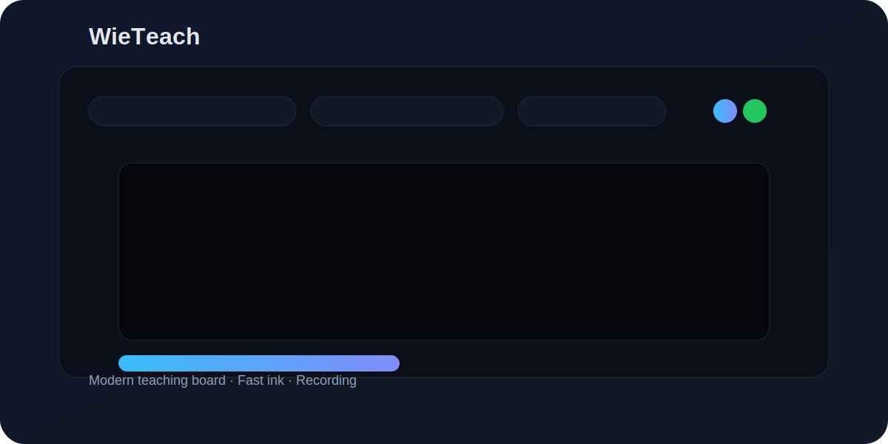

# WieTeach

A modern, high‑performance teaching board for instructors. Draw, annotate, import PDFs, manage slides, and record classes with webcam compositing.



## Why WieTeach
- **Low‑latency ink**: Smooth strokes with optimized rendering paths.
- **Class‑ready layout**: Teaching board + slides + quick tools.
- **Recording pipeline**: Composite board + webcam in real time.
- **Templates & assets**: Background patterns and custom templates.

## Features
- Pen, highlighter, laser, shapes, and fill tools
- Slide management with thumbnails
- PDF import and template background support
- Webcam overlay with chroma key and recording
- Recordings library and preview

## Quick Start
```bash
npm install
npm run dev
```

## Usage
1. Open **Class**.
2. Choose tools from the bottom dock.
3. Import PDF or templates from settings.
4. Start Class to record a session.

## Contributing
We welcome improvements! Please:
- Fork the repo
- Create a feature branch
- Submit a PR with a clear summary and screenshots

## License
MIT
