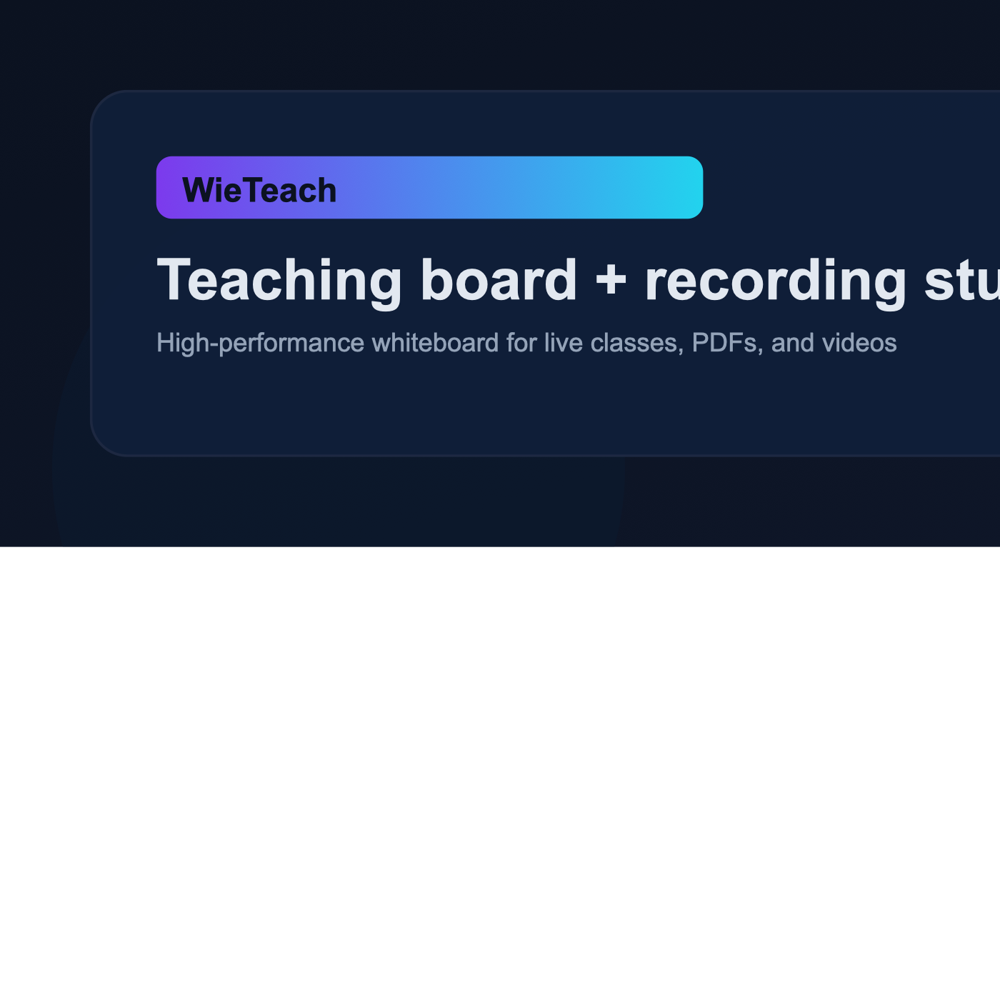
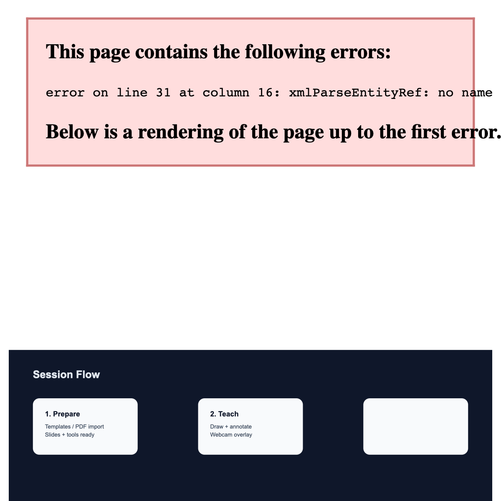
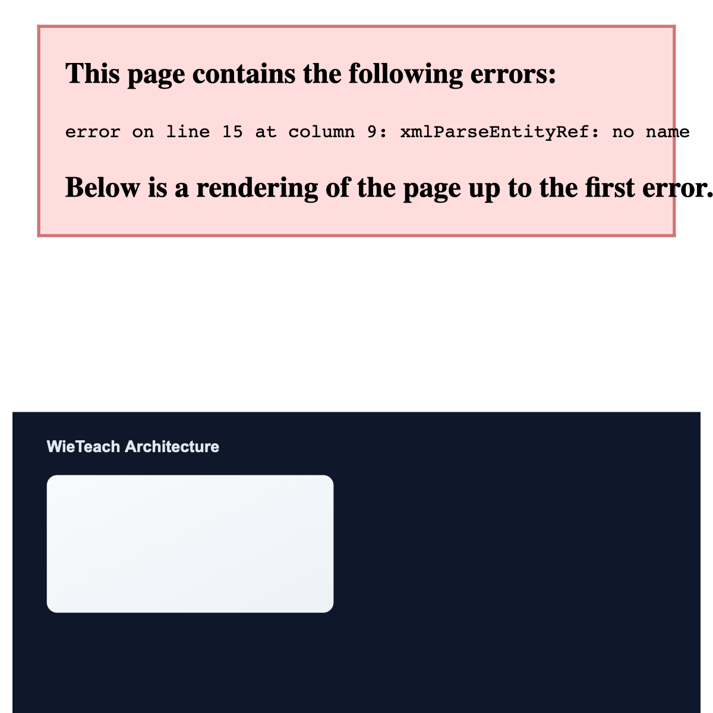

# WieTeach



Modern teaching board + recording studio for instructors. Built for fast inking, crisp PDFs, and production‑ready class recordings.



## Highlights
- **Low‑latency ink**: Optimized canvas pipeline for smooth strokes.
- **Slides + templates**: Manage decks, import PDFs, and apply templates.
- **Recording composite**: Board + webcam (chroma) into a 16:9 capture.
- **Persistence**: IndexedDB recordings + optional save‑to‑disk.
- **Exports**: JSON, PNG, and PDF.

## Architecture


## Tech Stack
- Vue 3 + Vite
- Canvas stack (background/ink/overlay)
- MediaRecorder (WebM) + mic merge
- PDF.js for PDF rendering
- IndexedDB via `idb`

## Quick Start
```bash
npm install
npm run dev
```

## Production Build
```bash
npm run build
npm run preview
```

## Usage
1. Open **Class**.
2. Select tools from the dock.
3. Import a PDF or template from settings.
4. Start class to record.

## Contributing
Professional PRs welcome.
- Fork the repo
- Create a feature branch
- Submit a PR with clear summary + screenshots

## License
MIT
